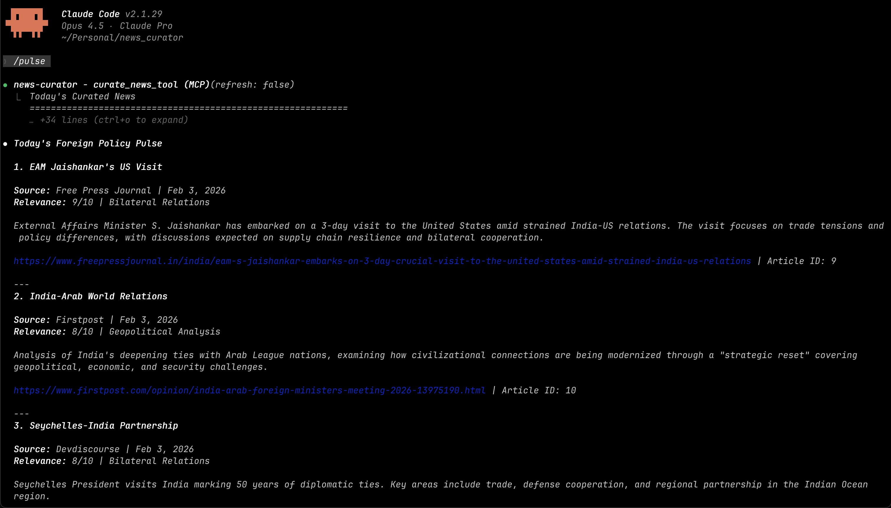

# News Curator

AI-powered news curation for foreign policy and diplomacy. Built with Ruby and Claude AI.

## What It Does

- Fetches news from GNews API every morning at 7 AM
- Claude AI analyzes and selects the 2 most relevant articles
- Explains why each article was chosen
- Learns from your feedback over time
- Access via `/news` command in Claude Code

## Screenshot



*The `/pulse` command showing curated foreign policy and diplomacy news*

## Quick Start

```bash
# Install
bundle install

# Configure
cp .env.example .env
# Edit .env - add your API keys from gnews.io and console.anthropic.com

# Setup
ruby setup.rb

# Test
./bin/curate --run
./bin/curate --show
```

## Claude Code Integration

Create `~/.claude/mcp.json`:
```json
{
  "mcpServers": {
    "news-curator": {
      "command": "ruby",
      "args": ["/ABSOLUTE/PATH/TO/mcp_server.rb"],
      "env": {
        "GNEWS_API_KEY": "your_key",
        "ANTHROPIC_API_KEY": "your_key"
      }
    }
  }
}
```

Install commands:
```bash
mkdir -p ~/.claude/commands
cp commands/*.md ~/.claude/commands/
```

Use it:
```bash
claude
> /news
```

## Daily Automation

```bash
ruby scheduler.rb &
```

Runs at 7 AM daily, curates 2 articles, saves to database.

## Commands

```bash
./bin/curate --run              # Run curation now
./bin/curate --show             # View today's articles
./bin/curate --feedback 1 --like    # Like article
./bin/curate --feedback 1 --dislike # Dislike article
```

## How It Works

1. Scheduler wakes at 7 AM
2. Fetches 30 articles from GNews
3. Claude AI reads each one
4. Selects top 2 based on relevance to foreign policy/diplomacy
5. Saves with explanations (relevance score, category, reasoning)
6. `/news` command retrieves from database instantly

## Requirements

- Ruby 3.2+
- [GNews API key](https://gnews.io/) (free tier)
- [Anthropic API key](https://console.anthropic.com/) (paid)

## MCP.json Location

The `mcp.json` file goes in `~/.claude/mcp.json` (your home directory), NOT in this repo.

## More Info

See [SETUP.md](SETUP.md) for detailed setup instructions and troubleshooting.
